# DiracMatrix

Mads Bahrami

## Documentation, examples, and verification of standard identities

### Overview

The DiracMatrix package constructs Dirac gamma matrices that satisfy the Clifford anticommutation relation for an arbitrary real symmetric metric in any dimension. It uses the Brauer-Weyl (Pauli-Kronecker) construction in flat space and extends to curved/non-flat metrics through a vielbein decomposition. It also exposes basis transformations into the Dirac and Weyl/chiral representations and two implementations of the canonical graded Clifford operator basis.

The package source lives at Kernel/DiracMatrix.wl. The exported public symbols are GammaMatrices, EuclideanGammaMatrices, FlatMetric, RandomCurvedMetric, MetricVielbein, ToDiracBasis, ToWeylBasis, NumericZeroQ, CliffordCanonicalBasis, and CliffordBasis.

### Mathematical background

#### Clifford relation

The defining property of the Dirac gamma matrices is the Clifford anticommutation relation:

$$
\{\gamma^{\mu},\gamma^{\nu}\}=\gamma^{\mu}\gamma^{\nu}+\gamma^{\nu}\gamma^{\mu}=2 \eta^{\mu \nu}\mathbb{I}_{N}
$$

where N = 2^Floor[n/2] is the spinor dimension for an n-dimensional spacetime.

#### Brauer-Weyl (Pauli-Kronecker) representation

For n = 2m or n = 2m + 1, a flat-space realisation in terms of Pauli matrices σ_j is:

$$
\Gamma^{2 k-1}=\mathbb{I}^{\otimes(k-1)}\otimes \sigma_{1}\otimes \sigma_{3}^{\otimes(m-k)}
$$

$$
\Gamma^{2 k}=\mathbb{I}^{\otimes(k-1)}\otimes \sigma_{2}\otimes \sigma_{3}^{\otimes(m-k)}
$$

and, for odd n, an additional

$$
\Gamma^{2 m+1}=\sigma_{3}^{\otimes m}
$$

#### Signed-diagonal metric

For a flat metric $\eta_{\mu \nu}$ = diag(+1, ..., +1, -1, ..., -1) with p positive entries and q negative entries, the gamma matrices are:

$$
\gamma^{\mu}=\Gamma^{\mu}  \text{if}  \eta^{\mu \mu}=+1
$$

$$
\gamma^{\mu}=i \,\Gamma^{\mu}  \text{if}  \eta^{\mu \mu}=-1
$$

The resulting algebra is Cl(p, q).

#### Vielbein construction for general metrics

For a general real symmetric metric g, a vielbein $e_{\mu}^{a}$(x) is computed such that $g_{\mu \nu}$ = $e_{\mu}^{a}$ $e_{\nu}^{b}$ $\eta_{ab}$ (equivalently g = $e^{T}$ · η · e), and:

$$
\gamma^{\mu}(x)=e_{a}^{\mu}\Gamma^{a}
$$

where η is the signature matrix and Γ^a are the flat-space gamma matrices in the orthonormal frame.

### Loading the package

```wolfram
PacletDirectoryLoad["/Users/mohammadb/Nextcloud/Mads/Quantum/DiracMatrix/DiracMatrixPackage"];
Needs["DiracMatrix`"]
```

### Function reference

List of public symbols:

```wolfram
?DiracMatrix`*
```

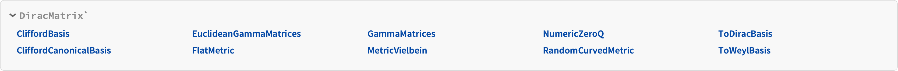

Selected usage messages:

```wolfram
?GammaMatrices
```

```wolfram
?EuclideanGammaMatrices
```

```wolfram
?FlatMetric
```

```wolfram
?RandomCurvedMetric
```

```wolfram
?MetricVielbein
```

```wolfram
?ToDiracBasis
```

```wolfram
?ToWeylBasis
```

```wolfram
?CliffordBasis
```

```wolfram
?CliffordCanonicalBasis
```

```wolfram
?NumericZeroQ
```

### Examples

#### Euclidean space (n = 4)

In Euclidean space the metric is the identity and the gamma matrices coincide with the flat-space Γ matrices.

```wolfram
MatrixForm /@ GammaMatrices[4]
```

#### Minkowski space (1, 3)

The mostly-minus Minkowski metric. By default the result is in the Brauer-Weyl basis.

```wolfram
MatrixForm@FlatMetric[1, 3]
```

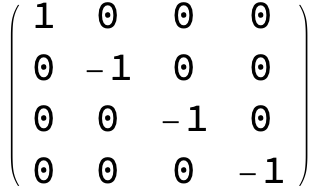

```wolfram
MatrixForm/@GammaMatrices[ηMink]
```


#### Split signature (2, 2)

Used in twistor theory and some lower-dimensional supersymmetric models.

```wolfram
MatrixForm/@GammaMatrices[FlatMetric[2, 2]]
```

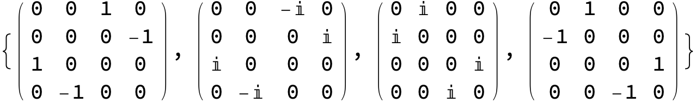

#### Six-dimensional Euclidean

The construction extends to any dimension; for n = 6 we obtain six 8x8 matrices.

```wolfram
MatrixForm/@GammaMatrices[6]
```

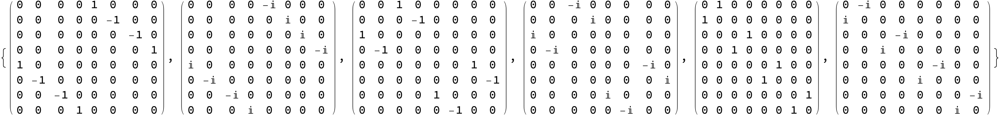

#### Schwarzschild metric at r = 3M

Evaluate the Schwarzschild metric components on the equatorial plane at r = 3M, giving diag(-1/3, 3, 9, 9).

```wolfram
MatrixForm/@GammaMatrices[DiagonalMatrix[{-1/3, 3, 9, 9}]]
```

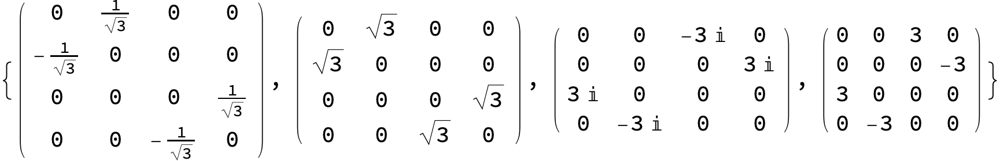

#### FLRW metric with scale factor a = 2

A spatially-flat FLRW slice with a = 2.

```wolfram
MatrixForm/@GammaMatrices[DiagonalMatrix[{-1, 4, 4, 4}]]
```

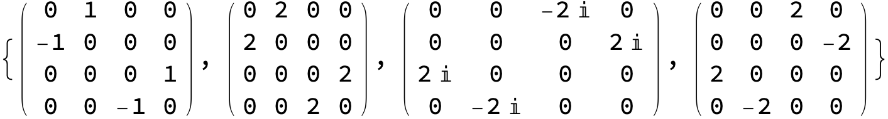

#### Random non-diagonal metric

A random real symmetric non-diagonal metric of signature (2, 2). The vielbein decomposition handles the general case.

```wolfram
SeedRandom[42];
ηRandom = RandomCurvedMetric[2, 2, 0.5, 1];
MatrixForm[ηRandom]
```

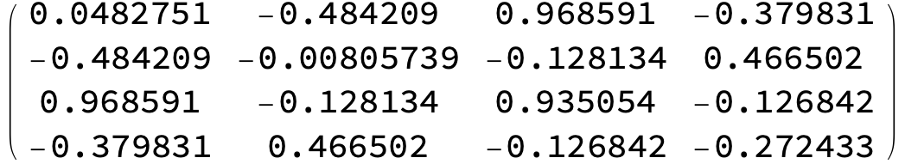

```wolfram
MatrixForm/@GammaMatrices[ηRandom]
```

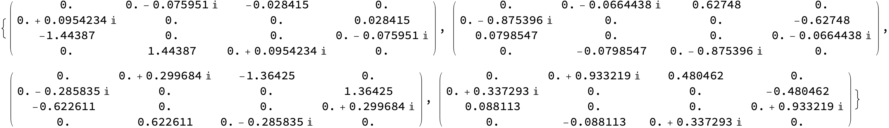

### Basis transformations

#### Brauer-Weyl basis (default output of GammaMatrices)

```wolfram
MatrixForm /@ GammaMatrices[FlatMetric[1, 3]]
```

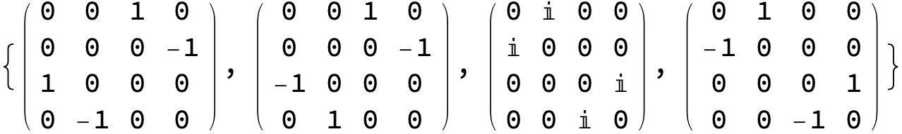

#### Dirac basis

In the Dirac basis $\gamma^{0}$ is diagonal.

```wolfram
MatrixForm /@ ToDiracBasis[GammaMatrices[FlatMetric[1, 3]]]
```

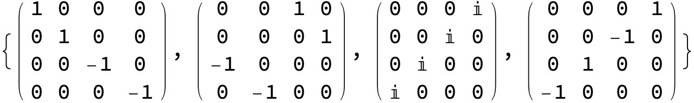

#### Weyl/chiral basis

The Weyl basis block-diagonalises the chirality operator.

```wolfram
MatrixForm /@ ToWeylBasis[GammaMatrices[FlatMetric[1, 3]]]
```

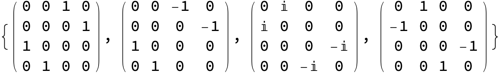

For odd dimension there is no Weyl/chiral decomposition; the function emits a message and returns the Dirac basis instead.

```wolfram
MatrixForm/@ToWeylBasis[GammaMatrices[FlatMetric[2, 3]]]
(* Output *)
ToWeylBasis
```

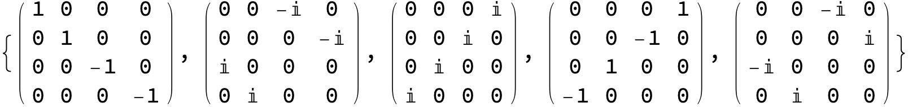

### Verification of standard identities

Each test below evaluates to True if the identity is satisfied for the listed range. For non-flat metrics, equality is checked numerically with NumericZeroQ.

#### Number of matrices and spinor dimension

There are n gamma matrices, each of size 2^Floor[n/2] x 2^Floor[n/2].

```wolfram
Table[Length @ GammaMatrices[n] == n, {n, 2, 10}] // Apply[And]
```


```wolfram
Table[Dimensions @ GammaMatrices[FlatMetric[p, n - p]] ==
    {n, 2^Floor[n/2], 2^Floor[n/2]},
  {n, 2, 10}, {p, 1, n - 1}] // Flatten // Apply[And]
```


#### Tracelessness

$$
\operatorname{Tr}(\gamma^{\mu})=0
$$

```wolfram
Table[With[{Γ=GammaMatrices[FlatMetric[p,n-p]]},Tr/@Γ==ConstantArray[0,n]],{n,2,10},{p,n-1}]//Flatten//Apply[And]
```


#### Anticommutator (Clifford relation)

$$
\{\gamma^{\mu},\gamma^{\nu}\}=2 \eta^{\mu \nu}\mathbb{I}
$$

```wolfram
Table[
  Module[{η = FlatMetric[p, n - p], Γ},
    Γ = GammaMatrices[η];
    Outer[#1.#2 + #2.#1 &, Γ, Γ, 1] ==
      2 TensorProduct[η, IdentityMatrix[2^Floor[n/2]]]],
  {n, 2, 8}, {p, n - 1}] // Flatten // Apply[And]
```


#### Square of a single gamma

$$
(\gamma^{\mu})^{2}=\eta^{\mu \mu}\mathbb{I}
$$

```wolfram
Table[
  With[{η = FlatMetric[p, n - p]},
    MatrixPower[#, 2] & /@ GammaMatrices[η] ==
      TensorProduct[Diagonal @ η, IdentityMatrix[2^Floor[n/2]]]],
  {n, 2, 8}, {p, n - 1}] // Flatten // Apply[And]
```

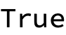

#### Trace of two gammas

$$
\operatorname{Tr}(\gamma^{\mu}\gamma^{\nu})=2^{\lfloor n/2 \rfloor}\eta^{\mu \nu}
$$

```wolfram
Table[
  With[{Γ = GammaMatrices[FlatMetric[p, n - p]]},
    Outer[Tr@*Dot, Γ, Γ, 1] ==
      2^Floor[n/2] FlatMetric[p, n - p]],
  {n, 2, 8}, {p, n - 1}] // Flatten // Apply[And]
```


#### Trace of four gammas

$$
\operatorname{Tr}(\gamma^{\mu}\gamma^{\nu}\gamma^{\alpha}\gamma^{\beta})=2^{\lfloor n/2 \rfloor}(\eta^{\mu \nu}\eta^{\alpha \beta}-\eta^{\mu \alpha}\eta^{\nu \beta}+\eta^{\mu \beta}\eta^{\nu \alpha})
$$

```wolfram
Table[
  Module[{Γ, η, A},
    η = FlatMetric[p, n - p];
    Γ = GammaMatrices[η];
    A = TensorProduct[η, η];
    Outer[Tr@*Dot, Γ, Γ, Γ, Γ, 1] ==
      2^Floor[n/2] (A - Transpose[A, {1, 3, 2, 4}] + Transpose[A, {1, 4, 2, 3}])],
  {n, 2, 6}, {p, n - 1}] // Flatten // Apply[And]
```


#### Contraction identities

$$
\gamma^{\mu}\gamma_{\mu}=n \,\mathbb{I}
$$

```wolfram
Table[
  Module[{η, Γu, Γd},
    η   = FlatMetric[p, n - p];
    Γu = GammaMatrices[η];
    Γd = Inverse[η] . Γu;
    Total @ MapThread[Dot, {Γu, Γd}] == n IdentityMatrix[2^Floor[n/2]]],
  {n, 2, 10}, {p, n - 1}] // Flatten // Apply[And]
```


$$
\gamma^{\mu}\gamma_{\nu}\gamma_{\mu}=(2-n)\gamma_{\nu}
$$

```wolfram
Table[
  Module[{η, Γu, Γd},
    η   = FlatMetric[p, n - p];
    Γu = GammaMatrices[η];
    Γd = Inverse[η] . Γu;
    Activate @ Transpose[
      TensorContract[Inactive[TensorProduct][Γu, Γd, Γd],
        {{1, 7}, {3, 5}, {6, 8}}],
      {2, 1, 3}] == (2 - n) Γd],
  {n, 2, 8}, {p, n - 1}] // Flatten // Apply[And]
```


#### Commutator identity

$$
\frac{1}{4}[[\gamma^{\mu},\gamma^{\nu}],\gamma^{\rho}]=\eta^{\nu \rho}\gamma^{\mu}-\eta^{\mu \rho}\gamma^{\nu}
$$

```wolfram
Table[
  Module[{Γ, η, A},
    η = FlatMetric[p, n - p];
    Γ = GammaMatrices[η];
    A = TensorProduct[η, Γ];
    1/4 Outer[Commutator[Commutator[#1, #2, Dot], #3, Dot] &, Γ, Γ, Γ, 1] ==
      Transpose[A, {2, 3, 1}] - Transpose[A, {1, 3, 2}]],
  {n, 2, 6}, {p, n - 1}] // Flatten // Apply[And]
```


#### Chirality (even dimension)

$$
\gamma_{c}=i^{(q-p)/2}\,\gamma_{0}\gamma_{1}\cdots \gamma_{2 m}
$$

It is Hermitian, squares to the identity, and anticommutes with every gamma.

```wolfram
Table[
  Module[{Γ, Γc},
    Γ  = GammaMatrices[FlatMetric[p, n - p]];
    Γc = I^((n - 2 p)/2) Dot @@ Γ;
    {HermitianMatrixQ[Γc],
     Γc . Γc == IdentityMatrix[2^Floor[n/2]],
     (Anticommutator[Γc, #, Dot] & /@ Γ) ==
        ConstantArray[0, {n, 2^Floor[n/2], 2^Floor[n/2]}]}],
  {n, 2, 8, 2}, {p, n - 1}] // Flatten // Apply[And]
```


#### Non-flat metrics

The same identities hold for arbitrary real symmetric metrics; numerical equality is checked with NumericZeroQ.

```wolfram
SeedRandom[12345];
Table[
  Module[{η, Γ},
    η = RandomCurvedMetric[p, n - p, 0.5, 1];
    Γ = GammaMatrices[η];
    NumericZeroQ[
      Outer[#1.#2 + #2.#1 &, Γ, Γ, 1] -
        2 TensorProduct[η, IdentityMatrix[2^Floor[n/2]]]]],
  {n, 2, 6}, {p, n - 1}] // Flatten // Apply[And]
```


### Canonical Clifford operator basis

The grade-k element of the canonical Clifford operator basis is the antisymmetrised product

$$
\Gamma_{[i_{1},\ldots,i_{k}]}=\frac{1}{k!}\sum_{\sigma \in \mathcal{S}_{k}}\operatorname{sgn}(\sigma)\Gamma_{i_{\sigma_{1}}}\cdots \Gamma_{i_{\sigma_{k}}}
$$

where $\mathcal{S}_{k}$ is the symmetric group on k indices.

#### Direct evaluation

CliffordCanonicalBasis is a literal transcription of the formula above. It is pedagogically transparent but combinatorially expensive, and on non-flat metrics it can lose precision at high grades because of cancellations between terms of widely different magnitudes.

```wolfram
CliffordCanonicalBasis[FlatMetric[1, 3]]
```

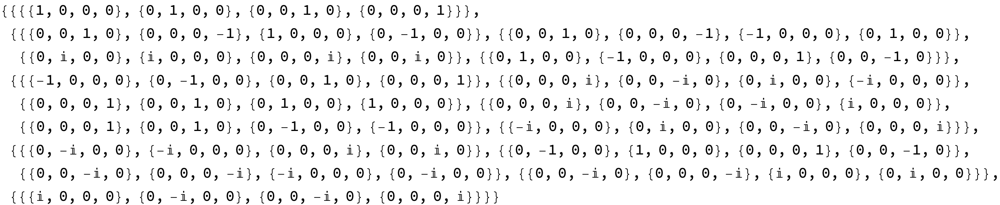

```wolfram
Length/@%
```


#### Antisymmetric recursion (production-ready)

CliffordBasis grows the basis grade-by-grade using the recursion

$$
\Gamma_{[\mathcal{I}\cup \{\mu \}]}=\Gamma_{[\mathcal{I}]}\cdot \Gamma_{\mu}-\sum_{j=1}^{|\mathcal{I}|}(-1)^{j-1}\eta_{\mu,i_{j}}\Gamma_{[\mathcal{I}\setminus \{i_{j}\}]}
$$

This avoids the explicit antisymmetrisation sum and is much more numerically stable. For flat metrics it agrees with CliffordCanonicalBasis at all grades.

```wolfram
CliffordBasis[FlatMetric[1, 3]] // Map[Length]
```

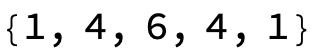

```wolfram
Table[
  With[{η = FlatMetric[p, n - p]},
    CliffordCanonicalBasis[η] === CliffordBasis[η]],
  {n, 2, 6}, {p, n - 1}] // Flatten // Apply[And]
```


#### Drift on non-flat metrics at high grade

For random non-flat metrics the two implementations agree at low grades but the explicit antisymmetrisation accumulates error at grades >= 4.

```wolfram
SeedRandom[12345];
Table[
  With[{η = RandomCurvedMetric[p, n - p]},
    NumericZeroQ[
      CliffordCanonicalBasis[η][[;; 3]] -
      CliffordBasis[η][[;; 3]]]],
  {n, 3, 6}, {p, n - 1}] // Flatten // Apply[And]
```


The mismatch at higher grades reflects numerical cancellation in the explicit-sum implementation, not an algebraic disagreement; prefer CliffordBasis in production.
